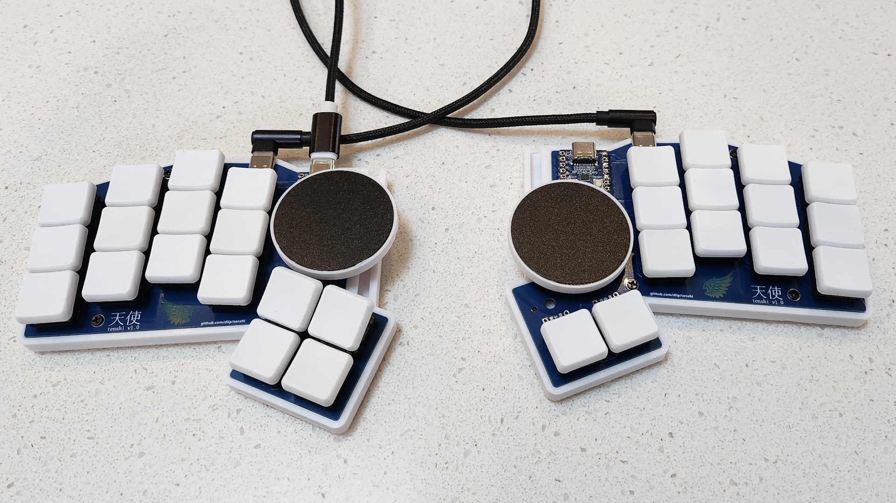
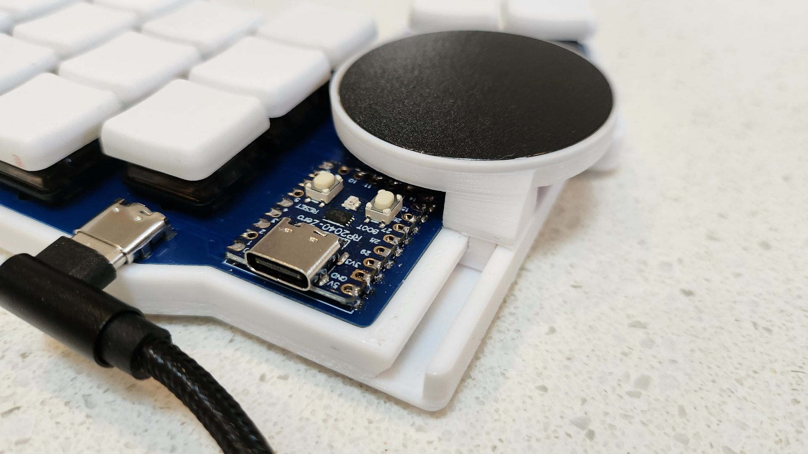
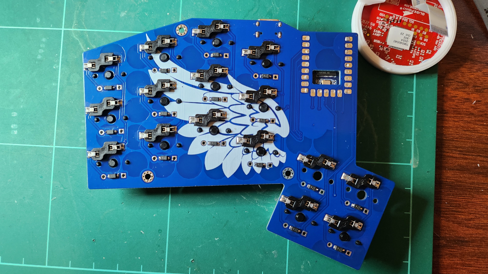
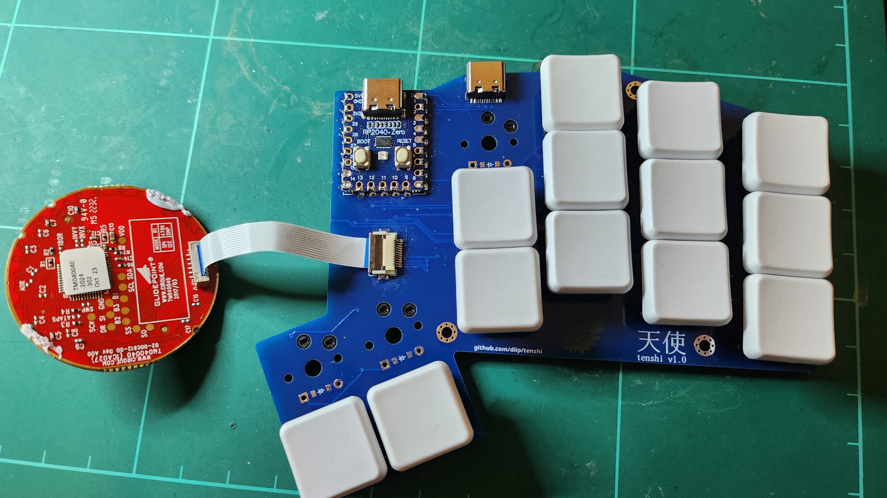
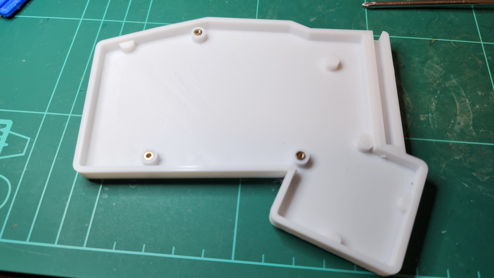

# Tenshi Keyboard

- RP2040-Zero controller
- Split using USB-C to connect the halves
- Slide-adjustable Dual Cirque 40mm trackpads
- QMK Firmware
- Custom PCB and case
- Name from Japanense means angel (the trackpads are the halos)

## BOM

- PCBs - send the [Gerber](kicad/gerber_to_order) file to the PCB manufacturer of your choice
- 2 x RP2040-Zero
- 2 x HRO TYPE-C-31-M-12 USB C female ports
- 2 x USB-C cables
- 0-2 x Cirque 40mm Trackpads TM040040-2024-302 with flat overlay
- 0-2 x Hirose FH12-12S-0.5SH FFC/FPC connectors
- 0-2 FFC/FPC cables - 5cm length, 12 position, 0.5mm pitch, same-sided contacts
- 32 x 1N4148 SOD-123 Diodes
- 32 x kailh hotswap sockets
- 32 x low profile choc switches and keycaps
- 6 x Knurled Insert Nuts M2 x 3mm Length x 3.5mm outer diameter
- 6 x M2 4mm flat head screws
- 8 x Rubber feet

## Printables

The .stls are in the [printables](./printables) folder and there is also the [OnShape Project](https://cad.onshape.com/documents/9fc41580bdc06f2de5a54d4e/w/2ac3b2b1ad9676183a17550a/e/836a95015accbfb788e70834) in case you want to make modifications.

## Build Pics

